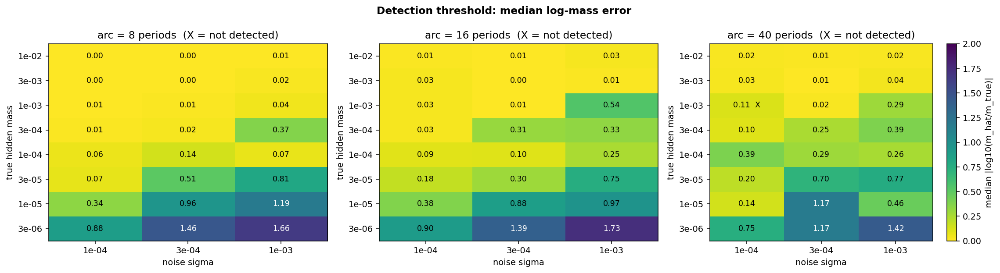
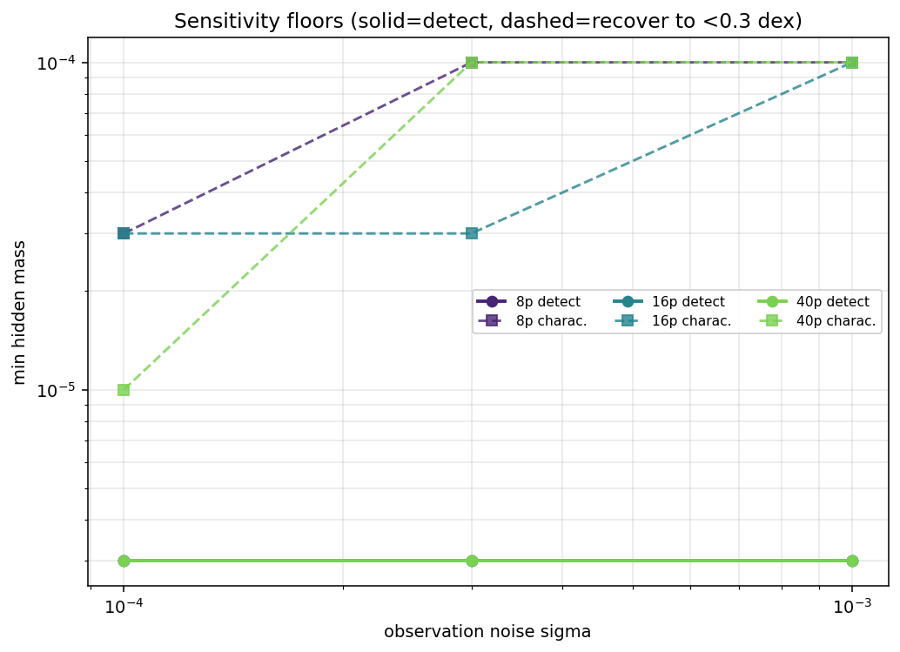
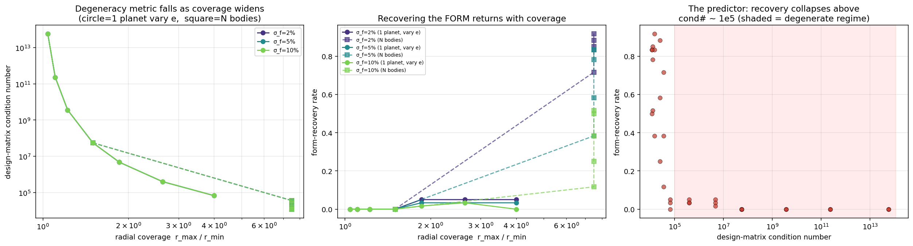
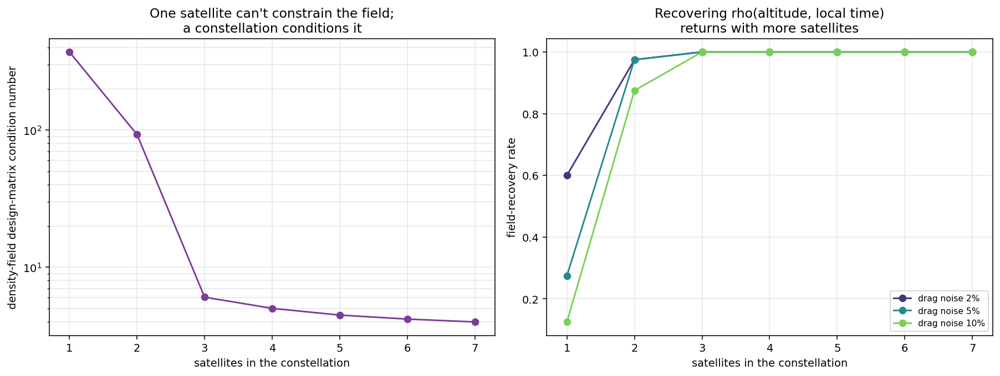
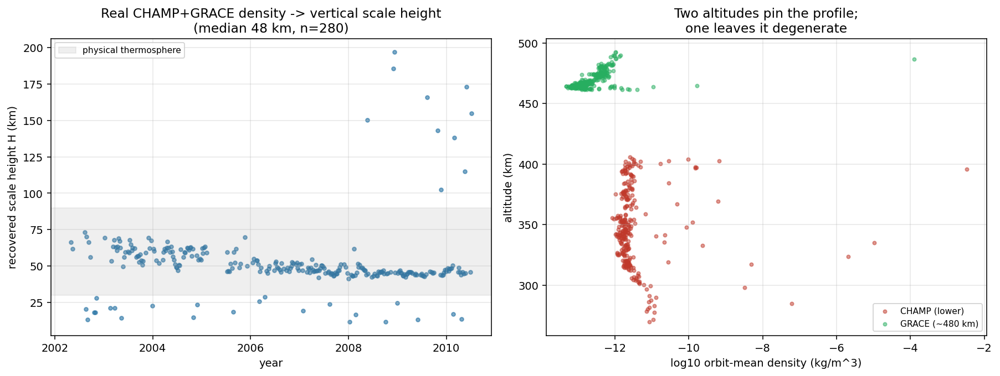
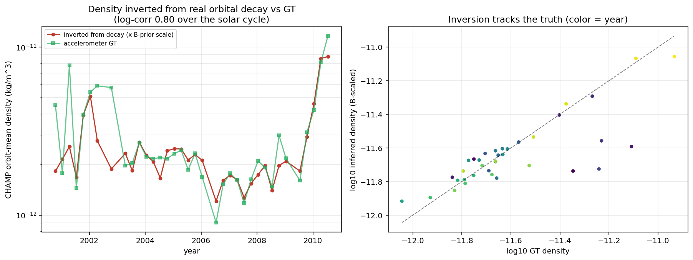
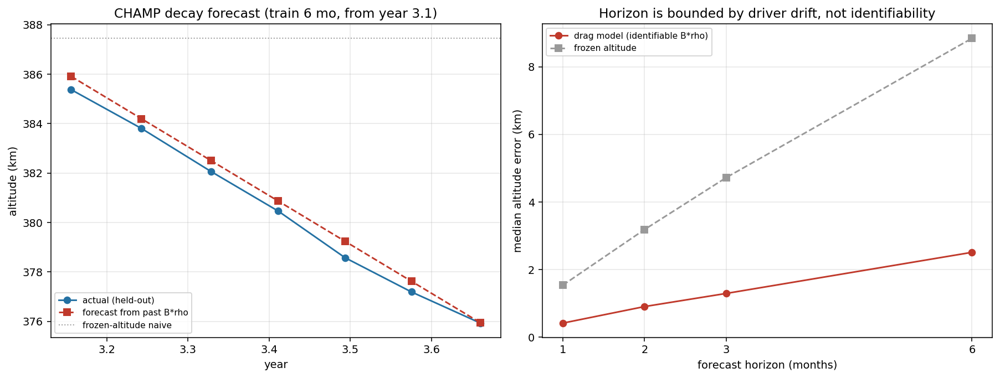

# Ariadne — Unknown-Force Discovery from Trajectories

[](https://www.python.org/downloads/)
[](https://pytorch.org/)
[](LICENSE)
[](https://github.com/Menex-lighty/ariadne/actions/workflows/smoke.yml)

> **Most inverse problems are underdetermined. Ariadne tells you where.**

Ariadne is a physics-informed inverse-problems toolkit that infers the **invisible cause of observed motion** — a hidden planet, an unknown force law, or the thermospheric density field a satellite falls through — by embedding the unknown inside a **differentiable N-body simulation** and fitting integrated trajectories to noisy data.

The same machinery is applied across three unrelated domains:

| Domain | Observed | Inferred | Real data |
|---|---|---|---|
| **Celestial mechanics** (M1) | visible planet tracks | hidden body's mass + orbit | synthetic |
| **Exoplanets** (M2 anchor) | Kepler-9 transit timings | planet masses & their degeneracy | [Holczer 2016 TTVs](data/kepler9/) |
| **Thermosphere / VLEO** (M3) | satellite orbital decay | density field ρ(altitude, local time) | CHAMP / GRACE / Swarm accelerometers |

Ariadne's distinctive contribution is **quantifying identifiability** — measuring *where* these inverse problems become degenerate and what data breaks the degeneracy.

---

## Why this matters

The recurring finding across all three domains is the same: **these inverse problems are degenerate in specific, measurable ways, and the degeneracy is broken by more coverage — not more precision.**

- **M1 — hidden-perturber detection:** a 216-cell study shows **detection is near-universal down to mass 3e-6**, but **mass characterization is the real limit** — the two floors sit 1–2 decades apart. See [docs/milestone1_results.md](docs/milestone1_results.md).
- **M2 — force-form identifiability:** recovery of an unknown force's *functional form* is governed by the **condition number of the force-law design matrix**; it collapses above ≈1e5. The radial *profile* is always recoverable; the *form* only when many bodies span a wide range. See [docs/identifiability.md](docs/identifiability.md).
- **Kepler-9 real-data anchor:** on real transit-timing variations, the planet **mass ratio is pinned to ~2%** while the mass **scale roams 15–75 M⊕** at comparable χ² — the documented "illusory precision," reproduced and quantified. See [docs/kepler9_node_postmortem.md](docs/kepler9_node_postmortem.md).
- **M3 — VLEO density field:** validated on real satellite data in every dimension:
  - **altitude:** CHAMP+GRACE recover a **48 km scale height**;
  - **local time:** GRACE-A recovers the **14 h diurnal bulge (≈2.5× day/night)**;
  - **inversion:** density inferred from CHAMP's real decay tracks the accelerometer truth at **0.80** over the solar cycle;
  - **prediction:** orbital decay forecast to **0.4 km at 1 month** from the identifiable B·ρ product. See [docs/m3_plan.md](docs/m3_plan.md).

---

## Installation

```bash
# Clone the repository
git clone https://github.com/Menex-lighty/ariadne.git
cd ariadne

# Install dependencies
pip install -r requirements.txt

# Add src/ to Python path (Windows)
$env:PYTHONPATH = "src"
# Or on Linux/macOS:
# export PYTHONPATH=src
```

Requirements: Python 3.10+, PyTorch 2.0+, NumPy, SciPy, Matplotlib, tqdm, nbformat. See [requirements.txt](requirements.txt).

> **Compute note:** the fit is **CPU-bound**. A Python-loop N-body integration over tiny tensors means a GPU is *slower* than CPU here.

---

## Quickstart

```bash
# ~2-minute self-testing M1 demo
python scripts/run_experiment.py --preset smoke

# Force-form degeneracy + restoration figure
python scripts/run_identifiability_study.py

# M3 synthetic constellation restoration
python scripts/run_vleo_identifiability.py

# Module self-checks
python -m perturber.drag
python -m perturber.density
python -m perturber.dynamics
```

For a full single experiment (~85 min CPU):

```bash
python scripts/run_experiment.py --preset local
```

For a detection-threshold sweep (parallel over CPU cores):

```bash
python scripts/run_sweep_parallel.py --grid core --workers 20
```

---

## Project structure

```
src/perturber/  M1: config, dynamics, data, integrators, model, fit, evaluate,
                plots, runner.  M2/identifiability: forces, residual, symbolic,
                identifiability, transits.  M3 (numpy): drag, density, threed.
scripts/        thin CLIs for M1 sweep and all M2/M3 analyses.
docs/           milestone results, identifiability theory, m3 plan, prior art,
                figures, and candid post-mortems.
data/           kepler9 (small, committed). stormai/tudelft/spaceweather = real
                VLEO datasets (~1.1 GB, gitignored — see docs for download).
legacy/         the original CD-PINN notebook this grew out of.
results/        gitignored run outputs.
```

---

## Key scripts

| Script | Purpose |
|---|---|
| `scripts/run_experiment.py` | Single M1 experiment with smoke assertions |
| `scripts/run_sweep_parallel.py` | Parallel detection-threshold sweep |
| `scripts/run_identifiability_study.py` | Force-form degeneracy + restoration |
| `scripts/run_kepler9_identifiability.py` | Real TTV analysis + degeneracy scan |
| `scripts/run_vleo_identifiability.py` | Synthetic constellation field-recovery demo |
| `scripts/run_stormai_*.py` | Real-data VLEO anchors (requires datasets) |
| `scripts/build_notebook.py` | Assemble `notebooks/kaggle_perturber.ipynb` from `src/` |

---

## Results gallery

Selected figures from the [`docs/figures/`](docs/figures/) directory (all committed to the repo):

| M1 detection threshold | M1 detection boundary | M2 force-form restoration |
|---|---|---|
|  |  |  |

| Kepler-9 mass degeneracy | Kepler-9 identifiability | VLEO constellation restoration |
|---|---|---|
|  |  |  |

| STORM-AI scale height | STORM-AI inversion | STORM-AI prediction |
|---|---|---|
|  |  |  |

*(Figures are generated by the scripts in [`scripts/`](scripts/). Add your own to `docs/figures/` if you want them rendered in the README.)*

---

## Scope & honest limits

- Synthetic-plus-real-anchor, mostly 2-D.
- The M3 modules are NumPy Fisher/STLSQ analyses **not yet wired into the differentiable torch pipeline** — that's the obvious next engineering step.
- Not a novel research contribution and not an operational tool.
- A rigorously-validated demonstration of one identifiability method across domains, and of the discipline of verifying it.

Positioning and prior art: [docs/related_work.md](docs/related_work.md), [docs/benchmarks.md](docs/benchmarks.md).

---

## Citation

If you use Ariadne in your research, please cite:

```bibtex
@software{ariadne_2025,
  title = {Ariadne: Unknown-Force Discovery from Trajectories},
  author = {YOUR NAME},
  year = {2025},
  url = {https://github.com/Menex-lighty/ariadne}
}
```

---

## License

This project is licensed under the MIT License — see [LICENSE](LICENSE).

---

**Not currently affiliated with any institution.** This is a personal research demonstration.
