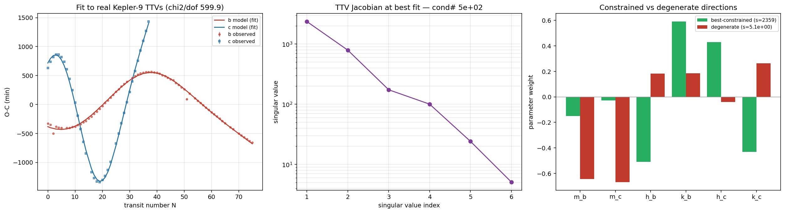
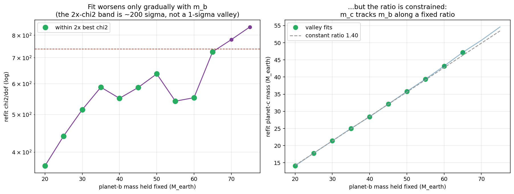
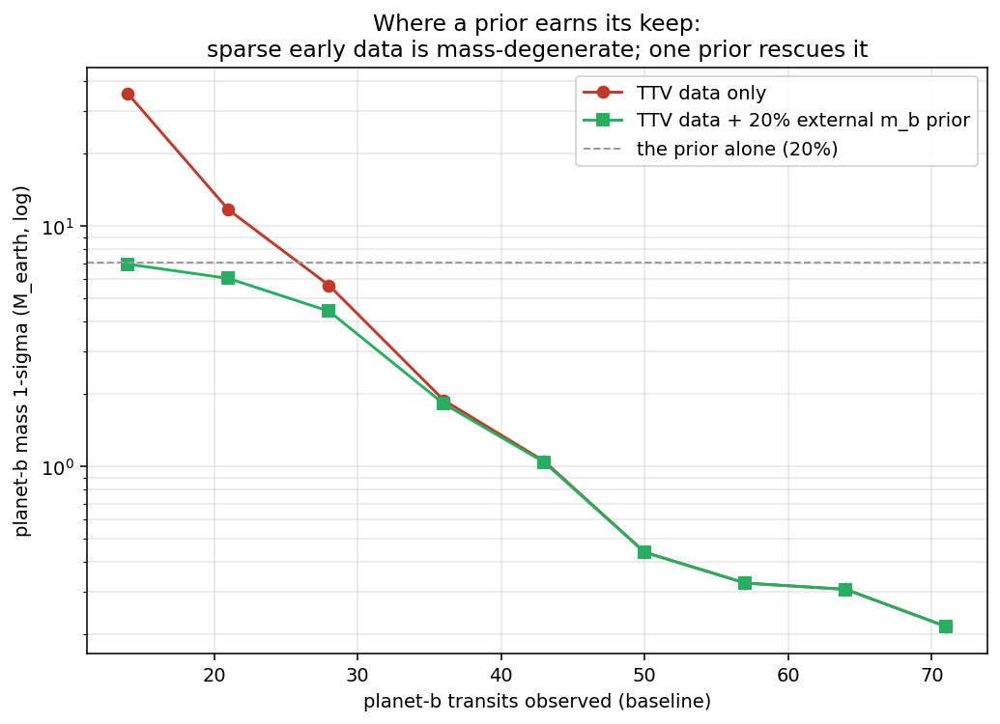

# Force-form identifiability: measuring the degeneracy

The literature on trajectory inverse problems (transit-timing variations, dark-
matter subhalos, modified gravity) routinely calls them *"degenerate"* — but
rarely says *where* or *how much*. That measurement is Ariadne's distinctive
contribution. This note quantifies when the **functional form** of an unknown
central force can be recovered from trajectories, and what restores it.

## Setup

Model an unknown central force as a sum over a power-law library,
`g(r) = Σ_k c_k r^{p_k}` with `p ∈ {-5,-4,-3,-2,-1,0,1}`, and inject a truth
`g(r) = 2e-3 / r⁴`. The bodies sample only the radii their orbits cover.

## Two questions, two very different answers

Fitting the injected law through the differentiable simulation (with a *perfect*
initial state, to isolate identifiability from state-estimation error):

- **Trajectory** — reproduced to the noise floor (χ²/pt ≈ 2).
- **Profile g(r)** — recovered over the sampled range (rel-RMS < 1%).
- **Form** — *not* recovered: the coefficients spread across the whole library
  instead of the sparse truth.

The trajectory and the profile are well-constrained; the *symbolic form* is not.
(Confirmed end-to-end in `scripts/run_identifiability.py`.)

## The predictor: design-matrix conditioning

Whether the form is recoverable is governed by the conditioning of the design
matrix `Φ[i,k] = r_i^{p_k}` (per-column normalised) over the sampled radii — a
best-case, purely analytic quantity (`perturber.identifiability`). Over a narrow
radial range the library columns are nearly collinear, so many coefficient
vectors fit the same profile.

| coverage (single orbit / N bodies) | r-range | condition # | form-recovery |
|---|---|---|---|
| near-circular (e≈0.05)  | [0.95, 1.05] | 2.3e11 | 0%  |
| eccentric (e≈0.5)       | [0.50, 1.50] | 2.1e5  | 0%  |
| 4 bodies over a∈[0.6,3] | [0.48, 3.12] | 1.5e4  | 83–92% |

Sweeping coverage and force-noise (`scripts/run_identifiability_study.py`,
figure `results/identifiability/restoration.png`) gives a clean law:

1. The condition number falls ~7 orders of magnitude as radial coverage widens.
2. **Form-recovery collapses above condition number ≈ 1e5** — a sharp, usable
   threshold that predicts identifiability *before* any fit.
3. The *profile* is recovered throughout; only the *form* depends on coverage.

## What restores it — and why it points at M3

A single eccentric planet improves conditioning but does **not** reach reliable
form-recovery (its samples stay concentrated). **Multiple bodies spanning a range
of semi-major axes do** — recovery rises to 72–92% at low force-noise, scaling
with body count and degrading gracefully with noise. That is precisely the
**multi-object joint constraint** at the heart of Milestone 3 (VLEO: many
satellites constraining one shared density field): the intervention that breaks
single-object degeneracy is *more bodies*, not more precision on one.

## Real-data anchor: Kepler-9

> **✔ Corrected 2026-07-09 (multistart, both nodes).** An earlier version of this
> section reported **χ²/dof ≈ 598** from a single cold-start fit and read the
> misfit as model inadequacy. That was under-optimization: a multistart fit over
> both transit nodes reaches **χ²/dof ≈ 180–192**. The numbers below are at the
> corrected fit. The story held qualitatively (ratio tight, scale loose, prior
> helps only when sparse); the details sharpened. See
> [kepler9_node_postmortem.md](kepler9_node_postmortem.md) — which also records
> that the *first* correction (blaming a transit-node convention) was itself
> wrong: it was optimization, not a node error.

The same idea — *a pre-fit conditioning number predicts which parameters are
recoverable* — transfers to real data, in **mass** space rather than force-form
space. Kepler-9's TTV **masses** are a documented degeneracy ("hidden solutions
behind a tight mass ratio", [ApJ 10.3847/1538-4357/ae74c9](https://iopscience.iop.org/article/10.3847/1538-4357/ae74c9)).
Using the real Holczer et al. 2016 transit times (`data/kepler9/`,
`scripts/run_kepler9_identifiability.py`), we **least-squares fit** a 3-body model
(star + b + c) to the observed O-C — fitting masses, eccentricity vectors, the c
period, and the two phases — with model transit times extracted at the observed
epochs by an edge-on transit finder (`perturber.transits`). At the best fit we
form the TTV Jacobian ∂(transit time)/∂(mass, eccentricity-vector), weighted by
the real ~1-minute timing errors.

The fit tracks Kepler-9's enormous anti-correlated TTVs (left; χ²/dof ≈ 185 at the
multistart optimum — the ~13-min residual is ~1% of the ~1000–2700-min signal,
i.e. ~99% of the TTV captured; the remainder is 2-D / higher-order model
inadequacy). At the best fit it recovers **m_b ≈ 40 M⊕, m_c ≈ 27 M⊕, ratio ≈
1.47** — but the mass *scale* is only loosely pinned (see the scan). The Jacobian's
**least-constrained direction is `m_b` and `m_c` moving together** (cond# ≈ 210 at
the fit); the eccentricity components are the best-constrained. So the mass *scale*
is the direction the TTVs constrain most weakly and the mass *ratio* the most
tightly — the structure behind "illusory precision."

**Read this honestly.** The formal Fisher 1-σ on m_b is ≈ 0.19 M⊕ — but that is
*illusory precision*: it treats the χ²/dof ≈ 185 misfit as if it were the noise
floor. The continuation scan tells the true story: fixing m_b and re-fitting
everything else, **χ²/dof stays in 177–218 as m_b ranges 15–75 M⊕** (a 5× span, all
within 2× the best χ²), while **the mass ratio stays locked to ~2% (1.43–1.53)**.
So the mass *scale* is effectively unconstrained by these TTVs — a flat valley —
and the well-determined quantity is the *ratio*, not either mass:

The famous ~26–80 M⊕ literature spread is therefore **multimodal / model-
dependent** (different data, priors, 2-D vs 3-D), a *global* effect this *local,
single-mode, 2-D* analysis cannot claim to reproduce. What it *can* claim: the
conditioning number correctly ranks the mass scale as the least-constrained
direction and the ratio as the best — a real, if modest, diagnostic.

**Prior-aware check (diagnosis → prescription).** Because a prior adds to the
Fisher information, the same tool says how much an external prior buys and where
(`perturber.identifiability.marginal_sigma`, `prescribe_prior`). On a *genuinely*
degenerate problem it collapses the unconstrained direction — a 2-parameter toy
goes from σ ≈ 13,600 to 0.7 with one prior. Applied to Kepler-9 at the **full**
Kepler baseline it correctly reports **little** to gain: the TTVs already
constrain the masses (a 20% external m_b prior barely moves them), because the
degeneracy there is global/multimodal, not local. The prescriptive value shows up
where data is *sparse*:

Scanning the observed baseline (`--prior-demo`): with only ~14 early transits the
TTVs leave planet b's mass essentially unconstrained (σ ≈ 30 M⊕ — the whole mass),
and one 20% external prior (an RV or mass-radius measurement) collapses it ~4×. The
two curves separate below ~28 transits (prior earns its keep) and merge above it
(the accumulating TTV signal overtakes the prior, which becomes redundant — which
is why it did nothing at the full 71-transit baseline). The tool thus says not
just *where* the degeneracy is but *when* an external measurement is worth
getting — diagnosis into prescription. (σ from the model-optimistic Fisher; the
relative crossover, not the absolute value, is the result.)

## Honest scope

Synthetic-plus-one-real-system, 2-D, one injected force law; the coverage sweep
is a best-case (direct-force-sample) analysis that upper-bounds identifiability
rather than modelling the full noisy trajectory inversion per point. Natural next
steps toward a citable note: tie the 1e5 threshold to an analytic collinearity
argument, add a second force family (e.g. Yukawa), and take the Kepler-9 test to
a 3-D photodynamical fit with a global degeneracy scan (the current 2-D multistart
fit already recovers the right degenerate direction — ratio pinned, scale free —
at χ²/dof ≈ 185).
