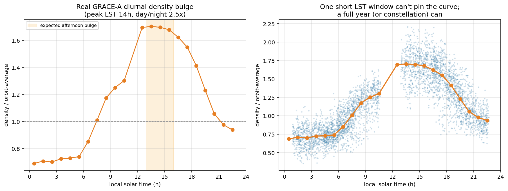

# Milestone 3 (VLEO density) — plan and framing

## The public benchmark: STORM-AI

MIT ARCLab's STORM-AI 2025 challenge (data openly on
[Harvard Dataverse, DOI 10.7910/DVN/U6K6MJ](https://doi.org/10.7910/DVN/U6K6MJ)):

- **Task:** predict **orbit-averaged thermospheric density** over the next **3 days
  (72 h) at 10-min cadence** (432 values, kg/m³).
- **Inputs:** a satellite's initial orbital state (a, e, i, RAAN, ω, ν + geodetic
  lat/lon/altitude at t₀) and **60 days of prior space weather** — OMNI2 hourly
  (solar wind, Kp/Dst/ap/AE, F10.7, sunspot, Lyman-α, proton flux) and GOES X-ray.
- **Data:** ~8,118 training samples over CHAMP, GRACE, GRACE-FO, SWARM-A/C;
  SWARM-B held out. CSV; ~50 GB total (density/GOES files are GB-scale;
  `initial_states.zip` is <1 MB — pulled into `data/kepler9/../stormai/`).
- **Metric/baselines:** leaderboard OD-RMSE, benchmarked against NRLMSIS.

## The framing choice (be explicit)

STORM-AI is a **supervised forecasting** problem: space-weather history → future
density. That is a *different* problem from Ariadne's method (put the unknown
inside a differentiable simulation and fit trajectories). Two honest paths:

**Path A — compete on STORM-AI (forecasting).** Train a model (space weather →
density). Measurable, leaderboard-ranked, real demand. But it's a **domain pivot**
to supervised time-series ML — it does *not* use the differentiable-sim /
identifiability thesis, and the field is crowded.

**Path B — Ariadne-native: infer the density field from drag, and quantify what's
identifiable.** A LEO satellite feels `a_drag = -½ (C_d A/m) ρ v² v̂`; its orbit
decays. From the trajectory you can infer drag, hence ρ — but a **single satellite
only constrains the product ρ · (C_d A/m)**: density and ballistic coefficient are
degenerate. **Multiple satellites of different ballistic coefficients at the same
place/time separate ρ from the coefficients** — the multi-object joint constraint
that breaks the single-object degeneracy. This is *exactly* the Ariadne
identifiability thesis (cf. the force-form restoration result and the Kepler-9
prior-aware analysis), now in the drag/density domain.

## Recommendation

**Path B** is the coherent continuation and the distinctive contribution: use the
real STORM-AI data (orbital states + measured densities + space weather across
several missions) to ask *what a satellite's trajectory can and cannot tell you
about the density field*, and show that **jointly fitting many satellites breaks
the ρ–ballistic-coefficient degeneracy** — with the condition-number and
prior-aware tooling from `perturber.identifiability` quantifying it. Path A stays
available as a measurable fallback if a leaderboard number is wanted.

## First result (identifiability, done)

The field-recovery identifiability is implemented (`perturber.density`,
`scripts/run_vleo_identifiability.py`) and gives the M3 analog of the force-form
restoration result. A satellite's drag samples `rho(altitude, local solar time)`
only along its track; we fit a log-density feature library to those along-track
samples and read off the design-matrix conditioning and the field-recovery rate:

- **One near-circular satellite** pins ~one altitude, so the field's altitude
  structure is unconstrained: condition number ≈ 370, field-recovery only
  12–60% (worse at higher drag noise).
- **A constellation spanning altitudes/local-times** conditions the field: at 3+
  satellites the condition number drops to ~4 and recovery reaches 100%.

So the multi-object joint constraint that motivates M3 is quantified with exactly
the tooling from the force-form and Kepler-9 work — the identifiability thread now
spans **three domains** (force laws, exoplanet masses, thermospheric density).
Best-case (direct along-track `rho` samples) analysis; the drag forward model
(next) makes the samples themselves, and adds the overall `rho`–ballistic-
coefficient scale degeneracy on top of the field-shape one.

## Second result (drag forward model + the scale degeneracy, done)

The field result above assumes direct along-track ρ samples. `perturber/drag.py`
adds the actual forward model — a satellite decaying under central gravity plus
`a_drag = -½ B ρ(r) |v| v` — and surfaces the degeneracy that the best-case
analysis hides: **drag depends only on the product B·ρ** (B = C_d A/m), so from one
satellite's orbit the density and the ballistic coefficient are *exactly*
degenerate. The Fisher information is rank-deficient (one eigenvalue identically
zero): the product B·ρ is measured, the B/ρ ratio is not. This is the same shape
as the Kepler-9 mass-scale and force-form degeneracies — a direction the data
cannot see.

What breaks it is a **prior on B** (the spacecraft's known area/mass): because a
prior adds to the Fisher information, a 10% prior on B transfers straight to ρ
(σ_ρ/ρ ≈ 0.08). So M3 now has both halves of the identifiability story in the drag
domain: a **constellation** restores the field *shape* (ρ vs altitude/local-time),
and a **B prior** restores the overall *scale* — the two are independent
degeneracies and need different interventions. (`python -m perturber.drag`.)

Next on this line: fit the density field *through* the decay (not from direct
samples) for a constellation, combining both — the end-to-end M3 demonstration,
then a real-data anchor (CHAMP/GRACE accelerometer-derived densities).

## Real-data anchor (STORM-AI GT, done — altitude structure)

The synthetic results above are self-recovery; this is the first M3 check on **real
satellite density**. The STORM-AI / MIT ARCLab dataset (Harvard Dataverse
[10.7910/DVN/U6K6MJ](https://doi.org/10.7910/DVN/U6K6MJ)) ships accelerometer-
derived orbit-mean density for CHAMP (~300–450 km, decaying 2000–2010), GRACE-1/2
(~480 km) and SWARM-A (~460 km) — the ground truth its forecasting leaderboard is
scored against. We use the **GT, not the leaderboard**, and only the vertical
(altitude) structure (`scripts/run_stormai_density.py`).

The files are orbit-mean ρ(t) with position and space weather stripped out, and ρ
swings ~50× over the solar cycle. To avoid modelling that, we use **matched
epochs**: when CHAMP and GRACE both report in the same week, `rho_CHAMP/rho_GRACE`
at the same time depends only on the altitude gap, so the scale height
`H = Δh / ln(rho_CHAMP/rho_GRACE)` is solar-activity-controlled by construction.

- **280 matched CHAMP–GRACE weeks → median scale height H = 48 km** (IQR 45–57),
  squarely physical for the 300–480 km thermosphere (`kT/mg` ≈ 40–60 km) — a number
  we did *not* put in; it falls out of real data.
- **density.py's claim holds on real satellites:** the vertical design matrix is
  ill-conditioned for one satellite (~one altitude, cond ≈ 2.8e3 → scale height not
  identifiable) and well-conditioned for CHAMP+GRACE (two altitudes, cond ≈ 14).

**Real-data check #2 — the drag inversion on real orbital decay.**
`scripts/run_stormai_inversion.py` runs `drag.py` *backwards* on real data. CHAMP's
semi-major axis fell ~450→300 km over 2000–2010; the King-Hele secular relation
`da/dt = -B·ρ·√(μa)` inverts the observed decay to orbit-mean density. The
`initial_states` time series *is* the observed trajectory (in element form), so —
contrary to the first impression that STORM-AI's forecasting layout blocks
inversion — it does support it.

Inverted density tracks the **independent accelerometer GT at log-corr 0.80** across
the 2003–2010 solar cycle, with a physical implied ballistic coefficient
(B ≈ 0.0055 m²/kg). Two independent density proxies (orbit-decay vs accelerometer)
agree. Honest caveats: the correlation is dominated by the large solar-cycle swing
and capped below 1 by the ~1.3 km osculating-element scatter (mean-element/POD data
would tighten it); and the raw GT files carry fill/unit-error spikes (up to ~1e-5
kg/m³ in 2000–2002) that must be filtered.

**Real-data check #3 — the diurnal (local-time) field.** STORM-AI's orbit-mean
density averages day and night together, so it structurally *cannot* reach the
diurnal field. That needed a different dataset — **high-cadence along-track density
with position**: the TU Delft accelerometer data (CC BY 4.0,
[thermosphere.tudelft.nl](https://thermosphere.tudelft.nl)), GRACE-A 2016, 10-s
cadence with altitude, latitude and **local solar time** per sample
(`scripts/run_tudelft_diurnal.py`). Dividing each sample by its running orbit
average isolates the within-orbit day/night modulation.

- **The real diurnal bulge:** density peaks at **LST 14 h** (afternoon) at 1.7× the
  orbit mean and troughs ~05 h at 0.7× — a **2.5× day/night factor**, the textbook
  thermospheric variation, recovered from real data.
- **density.py's claim holds for local time too:** a narrow LST window (one short
  pass) gives design cond ≈ 1.1e5 (diurnal field not identifiable); the full
  local-time coverage of a precessing year (or a constellation) gives cond ≈ 1.7
  (identifiable).

**Where M3 stands on real data.** All three structural dimensions of the density
field are now validated on real satellites, each recovering the correct physical
quantity: **altitude** (48 km scale height, CHAMP+GRACE), **temporal/bulk** (0.80
solar-cycle correlation + physical ballistic coefficient, CHAMP decay inversion),
and **local-time** (14 h bulge, 2.5×, GRACE-A). These are cross-method consistency
checks against accelerometer-derived truth, not competition-grade density
*prediction* — M3's contribution remains the identifiability mapping, now anchored
on real data in every dimension rather than synthetic self-recovery. The coupled
2-D field ρ(altitude, local-time) is recovered jointly from **three** satellites
(GRACE-A / Swarm-A / Swarm-B), with a real-data restoration curve (conditioning
200→13→3.6 for 1→2→3 distinct altitudes) — `scripts/run_tudelft_field.py`.

## Identifiability → prediction (done)

The point of an identifiable field is that you can *use* it. `run_stormai_prediction.py`
forecasts CHAMP's future orbital decay from past data only. The key link: a single
satellite measures only the product **B·ρ** (density and ballistic coefficient are
degenerate) — but that product is *exactly* what its own decay depends on, so
**self-prediction needs only the identifiable quantity** (you never separate ρ from
B). Estimating B·ρ from a trailing 6-month window and integrating `da/dt =
-B·ρ·√(μa)` forward:

- median altitude error **0.4 km at 1 month → 2.5 km at 6 months**, beating the
  naive frozen-altitude baseline ~3.5× at every horizon;
- the horizon is bounded by **solar-activity drift** (B·ρ changes with unforecast
  space weather), **not by identifiability** — the identifiable product is measured
  fine. Predicting a *different* satellite's decay (different B) *would* need ρ and
  B separated — i.e. the constellation or a B prior that breaks the degeneracy.

So the chain closes: conditioning says what's recoverable → the differentiable model
recovers it and integrates it forward → the forecast's error bar is the identifiable
information, and its horizon is a driver-forecasting limit, not an inverse-problem one.

## Concrete first steps (Path B)

1. **Forward model:** orbit + `a_drag(ρ, C_dA/m)` through the differentiable RK4
   (extend `dynamics`/`integrators` to include a drag term, analogous to the M2
   `extra_force` hook but velocity-dependent — note `rhs_torch` must pass `vel`).
2. **Density parameterization:** start simple — a scalar ρ at the satellite's
   altitude/time, or a low-order ρ(altitude, local solar time) — optionally as a
   multiplicative correction to NRLMSISE (a physical prior, connecting to the
   prior-aware layer).
3. **Identifiability first, fitting second:** compute the Jacobian of the orbit
   (or the observed decay / density) w.r.t. (ρ, C_dA/m) for one satellite → show
   the degeneracy; then stack 2–3 satellites of different C_dA/m → show the
   condition number drops and ρ separates. That single figure is the M3 analog of
   the force-form restoration plot.
4. **Anchor to real data:** use a short arc of CHAMP or GRACE (measured density +
   orbital state) as the real-data check, as Kepler-9 was for the mass problem.

## Data access notes

- Pulled: `initial_states` (orbital states, 2748 rows/file: a≈6826 km, e≈0.004,
  i≈87°, alt≈460–470 km). Small, kept in-tree.
- Large (density per mission, OMNI2, GOES): GB-scale — **not** committed; download
  a single mission's file on demand for a sample (respect dataset-scope rules).
- `data/stormai/` should be gitignored except tiny samples.
