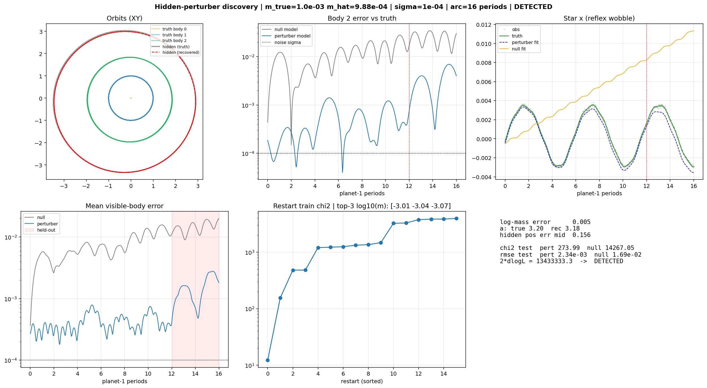

# Milestone 1 — Hidden-Perturber Discovery: Results

**Question.** Given noisy position tracks of the *visible* bodies in a planetary
system, can we recover the mass and orbit of an *invisible* gravitating body,
and where does that break down?

**Method.** Model acceleration as `a = known_gravity(visible + hidden)`, put the
hidden body's mass and orbital elements inside a differentiable RK4 N-body
integrator, and fit the forward-integrated visible trajectories to the noisy
observations (batched multi-start + short-arc curriculum, float64). A detection
is claimed only when the fitted perturber model beats a no-perturber **null
model** on a **held-out future window** (likelihood-ratio statistic
`2ΔlogL > 25`) — train-window fit quality alone is never sufficient.

**System.** Star (M=1) + two visible planets (a=1, 1.9; masses 1e-4, 3e-5) +
one hidden perturber (a≈3.2, e≈0.1), units G=1, 2-D. Deliberately near-Keplerian
so M1 isolates the inverse problem from chaos.

## Headline result

On a single 16-period, σ=1e-4 experiment the method recovers a hidden mass of
1e-3 as **9.88e-4 (log-mass error 0.005)**, semi-major axis to 0.6%, and predicts
the held-out window **7× better than the null model** (2ΔlogL ≈ 1.3e7). This is
the extrapolating, physically-structured recovery the legacy trajectory-smoothing
PINN could not do (its ISS test-window RMSE was 5× *worse* than SGP4).



*Recovered hidden orbit (red) overlaid on the invisible truth (grey); the star's
reflex wobble the perturber model captures and the null misses; and the held-out
window where the perturber prediction stays ~7× closer to truth.*

## Detection-threshold study

A grid over hidden mass (1e-2 → 3e-6) × noise (σ = 1e-4, 3e-4, 1e-3) × arc
(8, 16, 40 periods), 3 seeds/cell, median reported — 216 cells.


*Median log-mass error per cell; yellow = accurate (<0.05 dex), purple =
order-of-magnitude error. Only one cell (arc 40, σ=1e-4, m=1e-3) is not detected.*


*Detection floor (solid) sits flat at the grid bottom for all arcs — detection
never fails. The characterization floor (dashed, <0.3 dex) sits 1–2 decades
higher and worsens with noise. The gap between them is the headline.*

### Findings

1. **Detection is essentially universal — the floor is below the grid.** Across
   the whole realistic-noise grid, **71 of 72** (mass × noise × arc) points are
   detected, down to the smallest mass tested, **3e-6** — an order of magnitude
   below the *visible* planets (1e-4, 3e-5). Held-out likelihood ratios stay
   enormous even there (2ΔlogL ~ 1e4–1e6). Gravity couples the hidden body to the
   visible orbits strongly enough that its presence is statistically unmistakable
   long after its mass has become unmeasurable. Caveat on interpretation: the
   synthetic system *always* contains a perturber, so "detection" means the data
   decisively prefer *some* perturber over none; at tiny masses that is "extra
   gravity is present," not "we measured a 3e-6 body" (see #2).

2. **Characterization is the real limit, not detection.** Mass *recovery
   accuracy* degrades smoothly toward small mass and high noise: median log-mass
   error stays <0.05 for m ≥ 3e-3, passes ~0.3 dex around m ~ 1e-4, and reaches
   0.9–1.8 dex (mass wrong by 8–60×) at 3e-6. The `boundary.png` characterization
   floor (mass recoverable to <0.3 dex) sits **1–2 decades above** the detection
   floor: ~1e-5 (long arc, low noise) rising to ~1e-4 at σ=1e-3. "Is something
   there?" is far easier than "how heavy is it?"

3. **Longer arcs are not uniformly better** — a subtle but real effect. The
   held-out window is a fixed 25% *fraction* of the arc, so a 40-period arc is
   scored on a 10-period forward extrapolation. A slightly-imperfect perturber
   orbit accumulates phase error over that long window and can lose to the
   simpler null on pure prediction (one such non-detection: arc=40, σ=1e-4,
   m=1e-3, where 2ΔlogL went *negative*). Longer arcs give more training signal
   but a harder prediction test; the two trade off. A fixed-*length* held-out
   window would disentangle this (future refinement).

### Honest caveats

- **σ=1e-5 excluded.** At 10-ppm noise the first-order fit cannot reach the noise
  floor in a practical step budget (a fidelity sweep confirmed even 800
  curriculum steps stall at ~1e-2 residual), producing *spurious* non-detections.
  This is an optimizer-tolerance limit, not physics; σ=1e-5 is also
  unrealistically precise. Reaching it would need a second-order/LBFGS polish.
- **Reduced sweep fidelity.** Sweep cells use 12 restarts / trimmed curriculum
  (vs 16 / full for headline runs). Non-detections were checked for restart
  disagreement to distinguish physical non-identifiability from under-convergence.
- **Near-Keplerian, 2-D, synthetic.** M1 deliberately avoids chaos and real data;
  those are later milestones.

## Reproduce

```
python scripts/run_experiment.py --preset local        # headline single experiment
python scripts/run_sweep_parallel.py --grid kaggle --workers 20   # full sweep (CPU) -> results/threshold
python scripts/summarize_sweep.py --dir results/threshold
```
