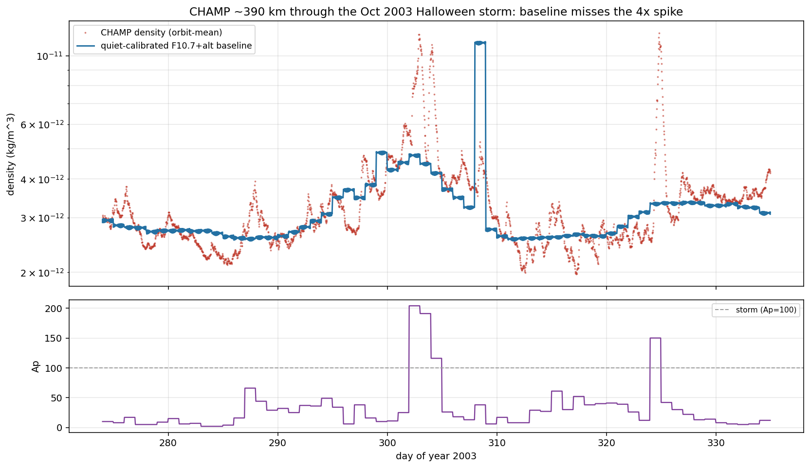
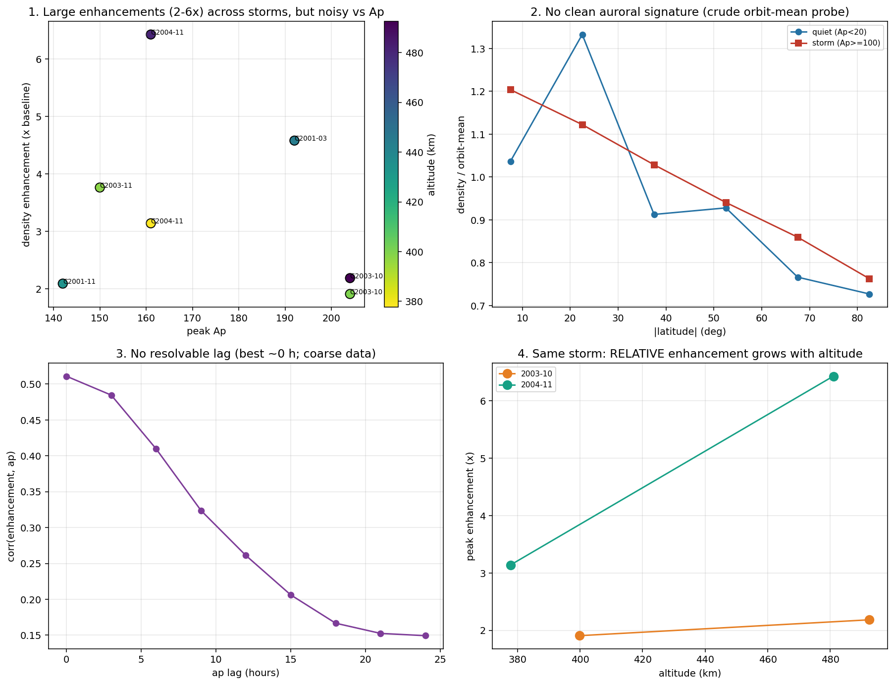

# Decision gate: is there a real niche for a VLEO drag nowcast?

Before committing to a tool, we asked one honest question: **is the density
variation that free public models miss a large, structured, recoverable signal, or
irreducible noise?** Three tests, and the answer flipped once we tested at the
altitude that actually matters.

## 1. How much is already solved by free data (`run_solar_density_variance.py`)

Regressing real GRACE orbit-mean density on public indices:

| predictors (all public) | R² |
|---|---|
| F10.7 daily | 0.52 |
| + F10.7 81-day average | 0.60 |
| + Ap | 0.60 |
| + altitude | 0.74 |
| + season | 0.74 |

**~74% is explained by free inputs** — which is exactly what NRLMSISE-00 / JB2008
already deliver. So "predict density from solar data" is a solved problem; no niche
there.

## 2. What's in the residual (`run_residual_decompose.py`)

- **Storms — negative at GRACE (480 km):** the base-model residual is *flat* across
  geomagnetic activity (quiet-day std 0.227 dex, active-day 0.203), and a better
  geomagnetic treatment recovers only +0.016 R². At 480 km, storms are not in the
  residual.
- **Local time — large but already modelled:** diurnal harmonics add +0.30 R² in
  along-track data, but the empirical models already include the diurnal bulge.

On this evidence the nowcast niche looked **weak** — and we nearly dropped it.

## 3. The fair test: a real superstorm at true VLEO (`run_champ_storm.py`)

The GRACE test was at the wrong altitude. Storm density enhancement grows sharply
as altitude drops. So we tested **CHAMP (~390 km)** through the **October 2003
"Halloween" superstorm** (peak Ap 204).

- **Density spiked ~3.6–4× above the quiet-calibrated F10.7+altitude baseline** at
  both major storms (Ap 204 and 150); median enhancement 1.6× during Ap≥100 vs 1.02×
  quiet. The free-index baseline misses it completely.
- **The miss tracks the storm** — correlation with the geomagnetic driver rises from
  0.33 (daily Ap) to **0.47** (3-hourly ap, 9 h lag): it is the storm response, not
  noise, and daily indices smear its hours-scale timing.
- **But it is *not* tightly index-predictable** (0.47, not ~0.9) — the equatorward
  propagation, lag and local-time structure of the storm response are exactly what a
  global index cannot pin.

## Verdict

The residual **is** a large, model-missed, driver-related but not-index-predictable
signal — **at true VLEO altitudes, during disturbed conditions.** That is precisely
the regime where a **real-time nowcast that assimilates a satellite's own drag**
(our differentiable-inverse machinery) beats both the empirical model and any
index-based correction. It is also exactly where operational drag error hurts most
(collision avoidance, reentry).

So the niche is **real but altitude- and regime-specific**: not a general density
model (solved), but a **storm-time VLEO drag nowcast/assimilation** layer on top of
the free baseline. This reconnects to the project's original VLEO-prediction goal,
aimed at the part existing free models handle worst.

**Caveats kept honest:** one storm, one satellite, orbit-mean density; a full case
needs more storms/altitudes and along-track (not orbit-mean) data, and the
assimilation value is real-time *correction*, which a variance regression only
partially captures. But the gate is cleanly passed: the signal is there, it is
structured, and free indices do not capture it.

## 4. Detailed sweep — 5 storm-months, 2 satellites (`run_storm_survey.py`)

Hardening the finding across CHAMP (2001-03..2004-11, ~380–480 km) and GRACE
(2003-10, 2004-11, ~486 km). It hardened the core and **corrected two of my
assumptions** — which is what a real sweep is for.

- **Hardened:** density enhancement is **2–6× across every storm and both
  satellites** — robust, not a Halloween one-off. But it is a **noisy** function of
  Ap (Ap=204 gave ~2×, Ap=161 gave up to 6×): storm *type*, altitude, and prior
  thermospheric state matter, not just the index.
- **Corrected (altitude):** I assumed lower altitude → bigger enhancement. The data
  shows the **opposite** for *relative* enhancement — it grows with **altitude**
  (GRACE 486 km > CHAMP 400 km in *both* shared storms). That is real physics: storm
  heating raises the scale height, a bigger fractional effect higher up. (Absolute
  density, hence drag, is still largest at low altitude — so the VLEO framing
  survives; the *scaling* was wrong.)
- **Inconclusive (structure):** a crude orbit-mean latitude probe showed no clean
  auroral signature (it's swamped by the diurnal/seasonal bulge geography), and no
  response lag resolved (best ~0 h). Proper characterisation needs LST-resolved,
  high-latitude-targeted, along-track (not orbit-mean) treatment.

**What the sweep changes.** The niche is *hardened* (robust, large, multi-storm) but
the storm response is **complex and not a clean function of any index** — which is
itself the strongest argument *for* assimilation over a formula: if a corrected
index model captured it, you would not need to assimilate the drag. The complexity
is the niche. It also means properly *characterising and validating* the nowcast is
a genuine research effort, not a quick build.
